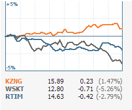

#HTML5 avancé

<!-- .slide: class="page-title" -->

## Introduction

Notes :

## HTML5 c'est ...

- De nouvelles balises
	- Des éléments de structure
	- Une meilleure sémantique
	- Formulaires plus intelligent
- Des APIs javascript
	- Drag'n'drop
	- Géolocalisation
	- Stockage client
	- Navigation hors-ligne
	- Canvas
	- Contenu audio et video
- Du CSS3
	- Animations, ombres, arrondis, transitions, ...
Notes :

## Mais aussi ...

- Les APIs « avancées »
	- XMLHttpRequest 2
	- Communication
		- Web messaging
		- Websockets
		- Server sent events
		- WebRTC
	- Scripts asynchrones ou les web workers
Notes :

## XMLHttpRequest 2

- Requêtes cross-origin
- Transfert de fichiers
- Monitoring
- Progress events
- ...

Notes :

## Web messaging

- Envoi de messages entre fenêtres, onglets et de contenu de différentes origines
- Ouverture d'un canal de communicationhttp://www.codeproject.com/Articles/248264/HTML5-WebMessaging-Experiment

Notes :

## Server sent events

- « push » de données depuis le serveur
	- Basé sur des techniques différentes selon l'implémentation serveur (polling, long polling...)
	- Notifications temps-réel, streaming, twitter wall, news...www.kaazing.me

Notes :

## WebSocket

- Protocole et API de communication temps-réel
	- Applications collaboratives ou type « réseaux sociaux », cours boursiers, ...www.kaazing.mehttp://mrdoob.com/projects/multiuserpad/

Notes :

## WebRTC

- API de communication temps-réel, peer to peer
	- Echange de flux audio, vidéo et données entre peers, sans intermédiaire, inter-navigateur

Notes :

## Web workers

- Exécution de scripts en arrière plan (sans bloquer la page)
	- Calculs complexes, manipulation de contenu multimédiahttp://www.html5rocks.com

Notes :

## Ressources

- Lire les spécifications :
	- W3C :http://www.w3.org/TR/

- Chercher le support :
	- www.caniuse.com
	- www.html5test.com
Notes :

<!-- .slide: class="page-questions" -->

<!-- .slide: class="page-tp1" -->