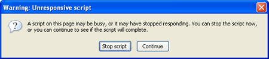

#HTML5 Avancé

<!-- .slide: class="page-title" -->


## Web Workers

Notes :


## Plan

- La multi threading en Javascript
- Pour commencer
- Limitation
- Communication
- Exemple
- Gestions des erreurs
- SubWorkers
- Shared Web Worker
Notes :


## La multi threading en Javascript

- javascript mono thread
	- On ne peut pas lancer plusieurs script en même temps
- On peut faire de l'asynchronisme
- setTimeout(), setInterval(), XMLHttpRequest, event handler
	- Mais ne se lance pas en même temps
- web workers apporte enfin le multi-threading
	- peut lancer des taches longues sans bloquer la navigation ou les autres scripts
Notes :


## La multi threading en Javascript

- Permet de garder l'IHM performante et utilisable par l'utilisateur
- On ne devrait donc plus trouver ce genre de fenêtre à l'avenir!

- Spécification :http://www.w3.org/TR/workers/



Notes :


## Pour commencer

- On appel un script worker depuis la page html
- Création : le constructeur spécifie l'URL du script à lancer
- le script doit avoir la même origine que la page qui l’exécute
- Pour envoyer un message ou une requête au worker, on utilise postMessage()
- Pour arrêter un Worker
	- Ou depuis le script du worker

```
var worker = newWorker('task.js');
```

```
worker.postMessage();
```

```
worker.terminate();
```

```
self.close();
```

Notes :


## Pour commencer

- Le worker scope
	- Dans le contexte d'un worker, self et this référencent le scope global du worker
- Dans le fichier worker
- Chargement de scripts externes depuis le worker avec la fonction importScripts
- Peut servir pour mutualiser du code appelé depuis le worker

```
postMessage();
//est équivalent à
self.postMessage();
```

```
importScripts('script1.js');
importScripts('script2.js');
//ou
importScripts('script1.js','script2.js');
```

Notes :


## Limitation

- Les workers, à cause de leur comportement multi-thread, ont un accès limité aux fonctionnalités javascript
- Ils n'ont pas accès:
	- Au DOM (qui n'est pas thread safe)
	- À l'objet window
	- À l'objet document
	- A l'objet parent
- Il ont accès
	- À l'objet navigator
	- À l'objet location (en lecture seule)
	- XMLHttpRequest
	- setTimeout()/clearTimeout() et setInterval()/clearInterval()
	- Au cache de l'application
Notes :


## Communication

- La communication entre le worker et la page parente se fait uniquement par message
- L'événement sera appelé quand le worker appellera son propre postMessage()

```
//dans la page html
<script>
var worker = new Worker('worker.js');

worker.addEventListener('message', function(event) {
console.log("Called back by the worker!\n");
}, false);

worker.postMessage("");// envoi de message au worker
</script>
```

Notes :


## Communication

- Les messages transmis entre la page principale et le worker sont copiés et non partagés.
- On peut aussi envoyer des messages au format JSON

```
//worker.js

postMessage("Je suis le Worker");

onmessage = function(event) {

postMessage('Hi '+event.data);

};
```

```
worker.postMessage({'cmd': 'stop', 'msg': 'Bye'});
```

Notes :


## Exemple

- La page principale

```
<!DOCTYPE HTML>
<html>
<head>
<title>Worker example: One-core computation</title>
</head>
<body>
<p>The highest prime number discovered so far is:<output id="result"></output></p>
<script>
var worker = new Worker('worker.js');
worker.onmessage = function (event) {
document.getElementById('result').textContent =event.data;
};
</script>
</body>
</html>
```

Notes :


## Exemple

- worker.js
- On calcule et affiche des nombres premiers sans bloquer l'IHM

```
var n = 1;
search: while (true) {
n += 1;
for (var i = 2; i <= Math.sqrt(n); i += 1)
if (n % i == 0)
continue search;
// found a prime!
postMessage(n);
}
```

Notes :


## Gestion des erreurs

- Quand une erreur apparaît pendant que le worker s'exécute l'événement ErrorEvent est déclenché
- L'interface contient:
	- Filename: le nom du script du worker
	- Lineno: le numéro de ligne de l'erreur
	- Message: la description de l'erreur

```
<script>
function onError(e) {
document.getElementById('error').textContent = [
'ERROR: Line ', e.lineno, ' in ', e.filename, ': ', e.message].join('');
}
function onMsg(e) {
document.getElementById('result').textContent = e.data;
}
var worker = new Worker('workerWithError.js');
worker.addEventListener('message', onMsg, false);
worker.addEventListener('error', onError, false);
worker.postMessage();
</script>
```

Notes :


## SubWorkers

- On peut lancer des SubWorkers depuis les Workers
	- Il faut que les SubWorkers aient la même origine que la page parente
	- L'URL dans le Subworker est résolue relativement au Worker parent
- Attention : ne pas oublier que les messages sont copiés et non pas partagés. Il ne faut donc pas créer une multitude de workers, cela pourrait demander trop de ressources clientes.
Notes :


## Shared Web Worker

- On a créé uniquement des dedicated Web Worker qui sont liés avec leur créateur (la page parente)
- Shared web workers autorisent plusieurs scripts à communiquer avec un seul Worker
- La communication se fait par un port

```
var worker = new SharedWorker("jsworker.js");
```

```
var worker = new SharedWorker("jsworker.js");
worker.port.addEventListener("message", function(e) {
alert(e.data);
}, false);
worker.port.start();
// post a message to the shared web worker
worker.port.postMessage("Alyssa");
```

Notes :


## Shared Web Worker

- Le worker en javascript
- Il faut définir la méthode onconnect
- Il faut passer aussi par la variable port

- Les shared Web Worker ne sont pas encore très courants
	- Support navigateurs : Chrome 4.0+, Safari 5.0+, Opera 10.6+

```
onconnect = function(e) {
var port = e.ports[0];
port.postMessage('Hello World!');
port.onmessage = function(e) {
port.postMessage('pong');//non pas e.ports[0].postMessage
//ou : e.target.postMessage('pong');
}
}
```

Notes :


## Cas d'utilisation

- Quelques cas d'utilisation possibles pour les workers :
	- Récupérer et ou mettre en cache des données
	- Mettre en forme du texte
	- Analyser un flux vidéo ou audio
	- Faire des opération sur le système de fichier
	- Ajouter un filtre sur des images
	- Faire des calculs sur la machine cliente
	- Faire des opérations sur la base de donnée cliente
Notes :


## Support web workers

- Navigateurs
	- Firefox 3.5+ (pas de support shared workers)
	- Chrome 4.0+
	- Safari 4.0+ (5.0+ pour les shared workers)
	- Opera 10.6+
	- IE10 (pas de support shared workers)
- Tester le support

```
if(!Worker) {
console.log("Votre navigateur ne supporte pas lesweb workers");
}
if(!SharedWorker){
console.log("Votre navigateur ne supporte pas lesshared workers");
}

```

Notes :


## TP


Notes :


<!-- .slide: class="page-questions" -->


<!-- .slide: class="page-tp1" -->