#HTML5 en pratique

<!-- .slide: class="page-title" -->


## Les balises


Notes :


## Plan

- Introduction
- Les balises
- CSS 3
- Javascript, le langage du web
- Vers des application plus interactives
- Gestion des données
- Multimédia
- Conclusion
Notes :


## Plan
Les balises

- Un Doctype simplifié
- Balises obsolètes
- Nouvelles balises sémantiques
- Des formulaires plus sexy
Notes :


## Un Doctype simplifié

- HTML5 utilise un tout nouveau DOCTYPE simplifié
- Les navigateurs utilisent alors un mode de rendu respectueux des standards

```
<!doctype html>
```

Notes :


## Balises obsolètes

- HTML5 déclare certaines balises comme obsolètes

- 

- Obsolètes car remplaçables par des styles CSS

- 
	- <basefont>
	- <big>
	- <center>
	- <font>
	- <strike>
	- <tt>
Notes :


## Balises obsolètes

- Supprimées car elles limitent l'accessibilité

- 
	- <frame>
	- <frameset>
	- <noframes>

- 

- Retirées car confuses ou remplaçables par d'autres composants

- 
	- <acronym>→<abbr>
	- <applet>→<object>
	- <isindex>→ champ de saisie normal
	- <dir>→ liste non numérotée<ul>
Notes :


## Nouvelles balises sémantiques

- HTML 5 tente d'apporter une dimension sémantique aux balises
- Permet une indexation intelligente
- Facilite la compréhension des documents
- Améliore l'accessibilité

- 

- 5 catégories principales

- 
	- Structure de page
	- Bloc masquable
	- Marqueurs de texte
	- Illustrations
	- Autre
Notes :


## Nouvelles balises sémantiques
Structure de document

- Structure du document

- 
	- section: conteneur générique, visant à grouper les éléments relatifs à un sujet donné
	- article: section auto-contenue, pouvant être extraite du document de manière indépendante (RSS...)
	- header: en-tête de page, de section ou d'article
	- footer: pied de page, conclusion de section ou d'article
	- aside: barre latérale, contenu additionnel relatif à un élément
	- nav: éléments de navigation intra- ou inter-documents
Notes :


## Nouvelles balises sémantiques
Structure de document

```

```

```
HEADER
```

```
ASIDE
```

```
SECTION
```

```
FOOTER
```

```
HEADER
```

```
FOOTER
```

```
ARTICLE
```

```
ARTICLE
```

```
ARTICLE
```

Notes :


## Nouvelles balises sémantiques
Structure de document

```
<header>...</header>

<aside>...</aside>

<section>
<header>...</header>
<article>...</article>
<article>...</article>
<article>...</article>
<footer>...</footer>
</section>

<footer>...</footer>
```

Notes :


## Nouvelles balises sémantiques
Bloc masquable

- Bloc masquable

- 
	- details: Bloc masquable, contenant des informations additionnelles. L'attribut "open" détermine si son contenu est visible
	- summary: Titre d'un bloc<details>

```
<details open>
<summary>Lorem ipsum</summary>
Lorem ipsum dolor sit amet, consectetur adipisicing elit...
</details>
```


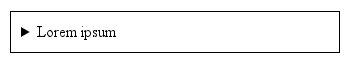


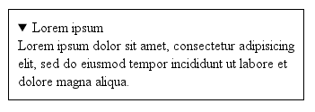

Notes :


## Nouvelles balises sémantiques
Marqueurs de texte

- Deux balises permettent d'accorder une signification particulière à une portion de texte

- 
	- mark: attire l'attention sur un extrait de texte, par exemple le résultat d'une recherche, ou un extrait de texte intéressant

- 
	- 

- 
	- time: microformat permettant de spécifier une date. Son attribut facultatifpubdateindique qu'il s'agit de la date de publication de l'article, section, ou document englobant.

```
<time>2009-11-13</time>
<time datetime="2009-11-13" pubdate>13 Novembre</time>

```

```
Cette formation vous est présentée par <mark>Zenika</mark>

```

Notes :


## Nouvelles balises sémantiques
Illustrations

- Pour compléter le texte par une illustration (image, tableau, code source...)

- 
	- figure: encapsule l'illustration et une légende optionnelle
	- figcaption: légende d'illustration

```
<figure>

<figcaption>Zenika</figcaption>
</figure>

```

Notes :


## Nouvelles balises sémantiques
Illustrations

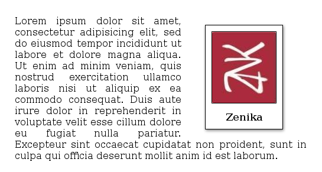

Notes :


## Nouvelles balises sémantiques
Autres éléments

- Custom data attributes :datasetetdata-*

- 
	- Permettent d'associer des données particulières à un élément du DOM

- 
	- Utilisées par certains frameworks comme jQuery Mobile (data-role="header")

```


```

```
$(this).find("img").dataset('fullpath'));

```

Notes :


## Des formulaires plus sexy

- HTML5 propose beaucoup de nouveautés pour les formulaires, facilitant à la fois le travail des développeurs etl'usage des utilisateurs
	- De nouveaux champs, qui se définissent avec la baliseinput
	- De nouveaux attributs, qui permettent de spécifier le comportement des champs :minimum, step, placeholder...
	- De nouveaux éléments :output, keygen, datalist
- Leurs implémentations dépendent des navigateurs

```
<input type="email"/>
```

Notes :


## Des formulaires plus sexy
Nouveaux champs

- Certains champs de saisie se différencient graphiquement

- 
	- <input type="color"/>

- 
	- <input type="date"/>

- 
	- <input type="number"/>

- 
	- <input type="search"/>

- 
	- <input type="range"/>

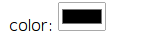


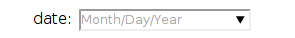


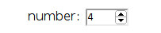


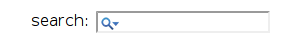


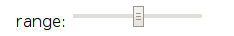

Notes :


## Des formulaires plus sexy
Nouveaux champs

- Les autres sont utilisés pour clarifier la sémantique des formulaires
	- 
		- tel
		- week
		- time
		- datetime
		- datetime-local
		- url
		- email
- Leur utilisation offre une validation du contenu
- Cela permet également de charger les claviers correspondants sur des systèmes mobiles

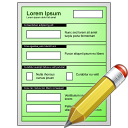

Notes :


## Des formulaires plus sexy
Nouveaux champs - Exemple

```
<form>
<label>Nom: </label>
<input type="text" name="name"/>
<label>Age: </label>
<input type="number" name="age"/>
<label>Date de naissance: </label>
<input type="date" name="birthday"/>
<label>E-mail: </label>
<input type="email" name="tel"/>
<label>Téléphone: </label>
<input type="tel" name="tel"/>
<label>Site internet: </label>
<input type="url" name="site"/>
<label>Mot de passe: </label>
<input type="password" name="password"/>
</form>
```


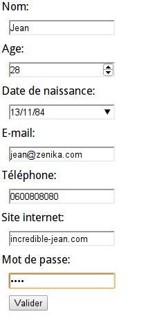

Notes :


## Des formulaires plus sexy
Validation

- De nouveaux attributs permettent de contrôler les valeurs, sans utiliser de javascript !

- 
	- Minimum, maximum

- 
	- 

- 
	- Incrément
- Ne fonctionne qu'avec ces types :number,range,date,datetime,datetime-local,month,timeetweek.

```
<input type="number" min="3" max="9"/>
<input type="date" max="2012-06-21"/>
```

```
<input type="number" step="3"/>
<input type="range" step="5"/>
```


Notes :


## Des formulaires plus sexy
Validation

- 
	- Validation par expression régulière, bloquant l'envoi des valeurs si le contenu n'est pas valide

- 
	- 

- 
	- Indication si le champ est vide, pratique pour guider les utilisateurs sur la nature du contenu

```
<input type="number" pattern="[1-9]{5}"/>
```

```
<input type="number" placeholder="Entrez votre âge" />
```


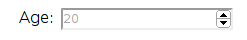

Notes :


## Des formulaires plus sexy
Validation

- 
	- L 'autocomplétion des champs par rapport à l'historique des formulaires précédemment complétés peut faciliter le remplissage
	- L'attribut s'utilise :
		- Avec la baliseformpour indiquer le comportement général
		- Avec la baliseinputpour spécifier le comportement d'un champ particulier

- 
	- 

- 

```
<formautocomplete="on"/>
<input type="email" />
<input type="password" autocomplete="off" />
```


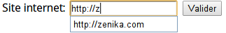

Notes :


## Des formulaires plus sexy
Validation

- 
	- Indication si un champ est requis, bloquant l'envoi des valeurs si aucun contenu n'est présent

- 
	- 

- 
	- Il est possible d'indiquer que la validation n'est pas nécessaire, sur un champ ou sur l'intégralité du formulaire

```
<input type="number"required/>
```

```
<formnovalidate>
<input type="submit"formnovalidate/>
```

Notes :


## Des formulaires plus sexy
Validation

- Un message s'affiche automatiquement si un champ requis n'est pas rempli ou si le contenu n'est pas valide
- Le message dépend de l'implémentation faite par les navigateurs

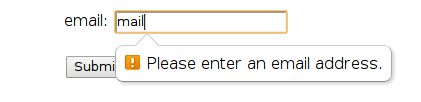


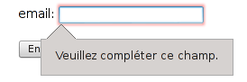


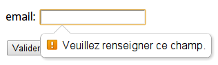

Notes :


## Des formulaires plus sexy
Validation

- Quelques lignes de Javascript permettent de définir des règles de validation particulières et ses propres messages

```
…
<input type="password" id="pass1"/>
<input type="password" id="pass2" oninput="check(this)"/>
…
<script>
function check(input) {
if (input.value != document.getElementById('pass1').value){
input.setCustomValidity('Erreur!');
}else{
input.setCustomValidity(''); //reset
}
}
</script>
```

Notes :


## Des formulaires plus sexy
Validation

- C'est particulièrement intéressant lorsque les champs sont interdépendants
- Ce système est bloquant pour la validation du formulaire

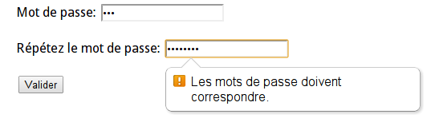

Notes :


## Des formulaires plus sexy
Validation - Exemple

```
<formautocomplete="on">
<input type="text" name="name"pattern="[a-zA-z]+"required/>
<input type="number" name="age"min="18" max="120" step="1" required/>
<input type="date"max="2010-01-01"name="birthday"/>
<input type="email"placeholder="email@example.com"name="tel"/>
<input type="tel"placeholder="0600112233"name="tel"/>
<input type="url"placeholder="http://site.com"name="site"/>
<input type="password" name="password" id="pass"autocomplete="off"/>
<input type="password" name="password2" id="pass2"autocomplete="off"/>
<input type="submit" value="submit"/>
<input type="submit"formnovalidatevalue="save"/>
</form>
```

Notes :


## Des formulaires plus sexy
Validation - Exemple

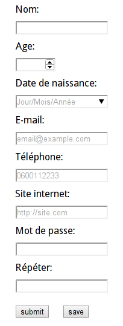

Notes :


## Des formulaires plus sexy
Nouveaux éléments

- Il est possible de définir des listes d'options avecdatalist

- 
- 
- 
- 
- 
- 

- On peut ensuite l'utiliser avec l'attributlistAttention, les listes peuvent servir à guider l'utilisateur,mais ne l'empêchent pas de saisir d'autres valeurs !

```
<datalist id="pays">
<option value="France">
<option value="Chine">
<option value="Italie">
<option value="Gabon">
<option value="Pérou">
</datalist>
```

```
<input type="search" list="pays"/>

```


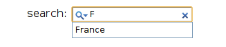


Notes :


## Des formulaires plus sexy
Nouveaux éléments

- Outputest une nouvelle balise qui sert à afficher un résultat
- Elle est pratique pour calculer des valeurs conditionnées par le contenu du formulaire

- 
- 

- 
- 
- 
- 
- 
- 

```
<form oninput="result.value = parseInt(a.value)
+ parseInt(b.value)">

<input type="number" name="a"/>
+
<input type="number" name="b"/>
=
<output for="a b" name="result"/>

```


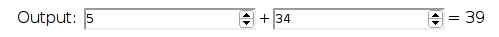

Notes :


## Des formulaires plus sexy
Nouveaux éléments - Exemple

- 
- 

- 
- 
- 
- 
- 
- 

```
<script>function calculate(){
(...)
if(product=="cookie")result=number;
else if(product=="brownie") result=number*2;
else if(product=="financier")result=number*3;
document.getElementById("price").value=result+"€";
}</script>
<formoninput="calculate()">
(...)<select name="product" id="product">
<option value="cookie">Cookie - 1€</option>
<option value="brownie">Brownie - 2€</option>
<option value="financier">Financier - 3€</option>
</select>
(...)<input type="number" min="0" max="12" id="number"/>
(...)<output for="product number" id="price"></output>
</form>

```


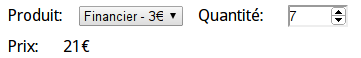

Notes :


Notes :


Notes :


<!-- .slide: class="page-questions" -->


<!-- .slide: class="page-tp1" -->