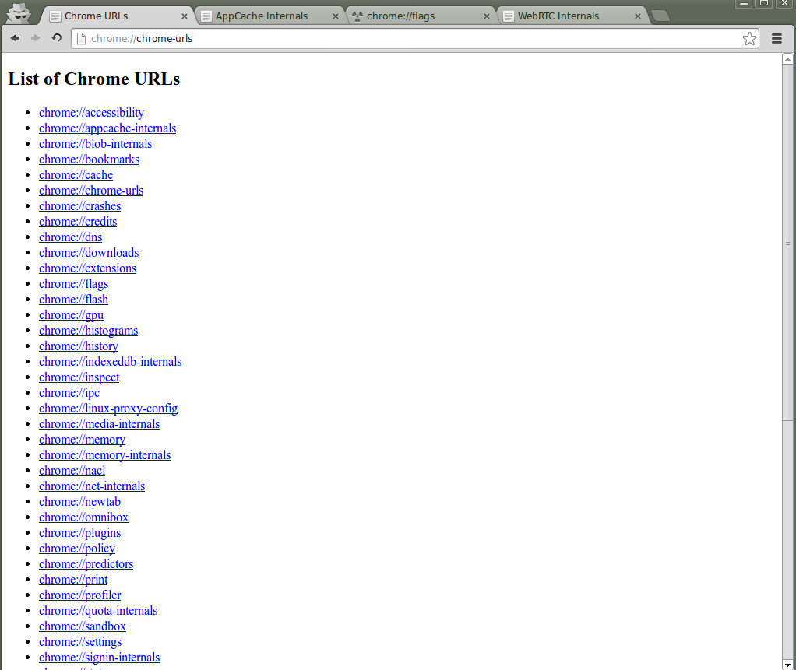

#HTML5 en pratique

<!-- .slide: class="page-title" -->


## Javascript, le langage du web


Notes :


## Plan

- Introduction
- Les balises
- CSS 3
- Javascript, le langage du web
- Vers des application plus interactives
- Gestion des données
- Multimédia
- Conclusion
Notes :


## Les points clés du javascript

- En Javascript, presque tout est objet (Array,String,Function...)
- Les points à comprendre pour ne pas tomber dans les pièges :
	- Comment itérer sur des objets ou tableaux
	- Lescope, ou portée des variables
	- Les opérateurs de comparaison de variables
	- Les paramètres implicites et les types invocations de fonctions
	- Les bons outils pour travailler / débugger
Notes :


## Itérer sur un objet ou un tableau

- En Javascript, un tableau est un objet. Il est possible de les parcourir l'un comme l'autre

- 
	- Parcourir un tableau

- 
	- Parcourir les propriétés d'un objet

```
var chiffres = ['un','deux','trois','quatre'];
var size = chiffres.length;
for(var i=0; i<size; i++){
doSomething(chiffres[i]);
}
```

```
for (var i in obj) {
console.log(i + " = " + obj[i]);
}

```

Notes :


## Scope des variables

- La portée ("scope") d'une variable détermine sa visibilité au sein du programme

- Il existe deux scopes

- 
	- Scopeglobal- accessible dans tout le programme- pas de mot-clé

- 
	- Scopelocal- accessible uniquement dans la fonction dans laquelle la variable est déclarée- mot-clévar
Notes :


## Scope des variables

```
// Global
foo = "foo";

function f() {
bar = "bar";// Global
varanswer = 42;// Local à f()
}

f();

// Affiche "foo"
console.log(foo);

// Affiche "bar"
console.log(bar);

// undefined car "answer" n'est
// visible que dans la fonction f()
console.log(answer);
```

Notes :


## Comparer des objets et variables

- Javascript offre deux façons de comparer des valeurs
	- ==compare en forçant les types (égalité abstraite)
	- ===compare les valeurs (égalité stricte). A préférer !

- Les variables peuvent prendre certaines valeurs spéciales
	- undefinedest l'état par défaut d'une variable non définie
	- nullest l'état d'un objet défini mais qui n'a pas de valeur
	- NaNsignifie "Not a Number" et caractérise généralement le résultat d'une opération sans résultat (ex :Math.sqrt(-4))

```
"1" == 1;// true
"1" === 1;// false

```

Notes :


## Fonctions et variables implicites

- Les fonctions définissent dans leur contexte 2 variables implicites

- 
	- argumentsreprésenteles paramètres passés à la fonction.Note : il est légal de passer un nombre de paramètres différent de celui défini dans la signature de la fonction.

```
function myFunc(a, b) {
for (i in arguments) {
console.log(i);
}
}

myFunc(1, 2, 3, 4);
```


Notes :


## Fonctions et variables implicites

- Les fonctions définissent dans leur contexte 2 variables implicites

- 
	- thisreprésente le contexte d'appel d'une fonctionAttention !Contrairement au "this" des langages objets traditionnels, le "this" de Javascript dépend de la façon dont la fonction estappelée.

```
foo = "foo";
function f() {
console.log(this.foo);// Erreur ? Pas toujours.
}
```

Notes :


## Fonctions et variables implicites

- Le type de fonction détermine le contexte vu parthis

- 
	- Fonctiontop-level:thisest l'objetwindow

- 
	- Méthode appelée sur un objet :thisest l'objet cible

```
function f() {
console.log("this="+this);
}
f();// this=[object Window]
```

```
var obj = {
f : function() {
console.log("this="+this);
}
}
obj.f();// this=[object Object]
```

Notes :


## Fonctions et variables implicites

- Le type de fonction détermine le contexte vu parthis

- 
	- Constructeur:thisest l'objet en cours de construction
	- Fonction appelée parapplyoucall:thisréfère à l'objet passé en premier paramètre

```
Math.min.apply(Math, [1, 2, 3, 4]);
```

```
function MyClass() {
console.log("this="+this);
}
var instance =new MyClass();// this=[object Object]
```

Notes :


## Debug et outils de qualité

- Webkit developer tools: disponible sur tous les navigateurs basés sur Webkit (Chrome, Safari)

- Firebug: plugin de Firefox avec de nombreuses fonctionnalités (visionnage du html, des scripts, des requêtes en fonction du temps, une console d'exécution de javascript...)
- JSLint: outil d'analyse statique développé par D. Crockford. Valide le javascript soumis et teste de nombreuses mauvaises pratiques.
- jsfiddle.net: application web pour tester des fragments de code. L'application permet d'incorporer la plupart des librairies connues.(jquery, extjs…) pour tester directement leurs fonctionnalités.
Notes :


## Chrome DevTools – Elements


Notes :


## Chrome DevTools – Elements

- Edition des styles CSS à la volée, sauvegarde possible dans le fichier cible (source map)
- Accès à tous les override CSS, convertisseur hexa, rgb, hsl
- Métriques sur l'élément sélectionné
- Edition du DOM, déplacement d'éléments en mode DragnDrop
- Simulation de l'état (hover, focus, ...)
- Breakpoints sur subtree modification, attribute modification, node removal
- Via le sous-onglet "computed" : accès aux propriétés aggrégées pour l'élément courant
- Accès aux Event Listener enregistrés sur chaque noeud
Notes :


## Chrome DevTools – Resources


Notes :


## Chrome DevTools – Elements

- Frames : Ressources statiques de l'application
	- 
		- Fichiers
		- Ressources
		- Javascript
		- Stylesheets
		- Images
- Différents types de stockage :
	- 
		- WebSQL Database
		- IndexedDB
		- Localstorage
		- Sessionstorage
		- Cookies
		- Application Cache
- La plupart des éléments accessibles ici sont modifiables et supprimables
Notes :


## Chrome DevTools – Network


Notes :


## Chrome DevTools – Network

- Toutes les requêtes, filtrables par type
	- 
		- Image
		- xhr / ajax
		- Scripts
		- Websockets
- Détail de chacune des requêtes avec les entêtes, headers, réponse...
- Nombreuses options accessibles via clic droit
	- 
		- Copy link
		- Copy as cURL
		- Copy as HAR
- Les notifications de Server Sent Event ne sont pas visibles car elles sont gérées par le navigateur qui vous transmet seulement un évènement.
Notes :


## Chrome DevTools – Sources


Notes :


## Chrome DevTools – Sources

- Visualisation et édition (CSS, JS, HTML)
- Debugger
	- 
		- Possibilité de placer des breakpoints
		- Accès au scope courant
		- Watch de variable
		- Callstack
		- Debugger spécifique Workers
- Pretty print (bouton "{}") pour formattage et deminification
- Pause on exceptions (bouton "pause")
- Historique des modifications via clic droit
Notes :


## Chrome DevTools – Console


Notes :


## Chrome DevTools – Console

- Interprétation / exécution de code dans le scope courant (si script en pause, utilisation du contexte de l'endroit en pause)
- Visionnage d'un objet du scope et de toutes ses propriétés
- Sélection d'éléments avec $('#element') comme du jQuery (selecteur Bling). Possibilité d'accéder aux éléments précédemment sélectionnés via $0, $1, $2...
- Monitorer les évènements sur un élément : monitorEvents($('#element'))
- console.table(array) permet de faire afficher un array de manière plus lisible
Notes :


## Chrome DevTools – General


Notes :


## Chrome DevTools – General

- Raccourcis claviers
- Experiments si activées dans about:flags
- Désactivation du cache
- Géoloc fictive
- Source mapping
- Emulation mobile
- …
- http://anti-code.com/devtools-cheatsheet/
- https://developers.google.com/chrome-developer-tools/
Notes :


## Chrome Urls




Notes :


## Chrome Urls

- chrome://chrome-urls/
- Extension : Google Chrome Service Pages
	- 
		- chrome://appcache-internals
		- chrome://flags/
		- chrome://indexeddb-internals/
		- chrome://inspect
		- chrome://webrtc-internals
Notes :


Notes :


<!-- .slide: class="page-questions" -->


<!-- .slide: class="page-tp1" -->