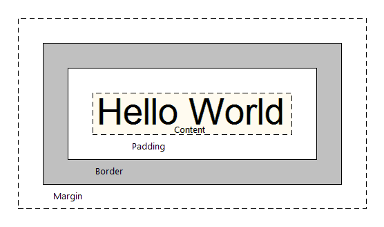
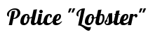

# CSS 3

<!-- .slide: class="page-title" -->


## Plan

<!-- .slide: class="toc" -->

- [Introduction](#/1)
- [Nouvelles balises](#/2)
- **[CSS 3](#/3)**
- [JavaScript, le langage du web](#/4)
- [Vers des application plus interactives](#/5)
- [Gestion des données](#/6)
- [Multimédia](#/7)
- [Conclusion](#/8)

Notes :


## Définition

- Les feuilles de style CSS (Cascading Style Sheets) permettent de définir le style d'un document web
	- Séparation claire entre les données et leur présentation
- Une règle CSS associe un ensemble de propriétés graphiques aux éléments du document correspondant à des critères (type de balise…) définis par un sélecteur CSS
- CSS3 est une norme encore récente, et en évolution constante. Le degré et la qualité d'implémentation peuvent varier selon les navigateurs

```css
.warning { /* <- sélecteur */
    color: red; /* <- propriété graphique */
}
```

Notes :


## Les sélecteurs

- CSS3 apporte un grand nombre de nouveaux sélecteurs

	- `:nth-child(n)` pour sélectionner tous les n-ièmes enfants
	- `:checked`, `:enabled`, `:disabled` pour sélectionner tous les inputs cochés, actifs ou non-actifs
	- `:not(selector)` pour exclure certains éléments

```css
div:not(#special) /* Les `<div>` sauf  `<div id="special" />` */
```

```css
input[type=checkbox]:checked /* Les checkboxes cochées */
```

```css
table:nth-child(2n) /* Lignes paires du tableau */
table:nth-child(2n+1) /* Lignes impaires du tableau */
```

Notes :


## Les sélecteurs

- CSS3 apporte un grand nombre de nouveaux sélecteurs
	- `::selection` pour obtenir les éléments sélectionnés par l'utilisateur
```css
::selection {
    background-color: #888;
    color:#FFF;
    text-shadow: 1px 1px 1px #000;
}
```


	- Mais aussi `:first-child`, `:last-child`, `:first-of-type`, `:last-of-type`, `:nth-of-type`, `:empty`, …
    
Notes :


## Déclaration des styles

- Les styles CSS peuvent être définis
	- Directement sur une balise HTML
    ```html
    <div style="color:red;" />
    ```
	- Dans la section `<head>` d'une page HTML
    ```html
    <head>
        <style>
         .warning {color:red;}
        </style>
    </head>
    ```
	- Dans un fichier séparé, référencé dans la page
    ```html
    <head>
        <link rel="stylesheet" href="style.css" type="text/css">
    </head>
    ```

Notes :


## Préfixes propriétaires

- Il sera parfois nécessaire d'utiliser des préfixes propriétaires pour activer le support de certaines propriétés
    - `-o-` : Opéra
    - `-webkit-` : Safari et Chrome
    - `-moz-` : Firefox
    - `-ms-` : Internet Explorer
    - Vérifier le support dans les tables de compatibilité ! [http://caniuse.com](http://caniuse.com)

Notes :


## Préfixes propriétaires

- exemple

```css
div {
    column-count : 3;
    -o-column-count : 3;
    -moz-column-count : 3;
    -webkit-column-count : 3;
}
```

Notes :


## Le modèle de positionnement

- L'espace occupé à l'écran par un élément est déterminé par
	- La taille de son contenu
	- `padding` : l'espace blanc laissé autour du contenu, à l'intérieur de la bordure
	- `border` : l'épaisseur de la bordure de l'élément
	- `margin` : l'espace blanc laissé autour de la bordure
- Les valeurs par défaut dépendent des éléments et des navigateurs, il est donc recommandé de les réinitialiser manuellement

```css
* { padding:0; border:none; margin:0; }
```

Notes :


## Le modèle de positionnement



Notes :


## Le modèle de positionnement

- La propriété box-sizing précise quelles valeurs sont prises en compte dans le calcul des propriétés `width` / `height` d'un élément
- `box-sizing: content-box`
	- Valeur par défaut, historique
	- width/height = contenu de l'élément
	- Taille à l'écran : width/height + padding + border + margin
- `box-sizing: border-box`
	- HTML 5, calcul plus intuitif
	- width/height = contenu de l'élément + padding + border
	- Taille à l'écran : width/height + margin

Notes :


## Le modèle de positionnement

<table>
   <thead>
       <th style="text-align:center;">border-box</th>
       <th style="text-align:center;">content-box</th>
   </thead>
    <tbody>
    <tr>
        <td></td>
        <td></td>
    </tr>        
    </tbody>
</table>

Notes :


## Le modèle de positionnement

Avec l'inspecteur de Chrome


Notes :


## Le modèle de positionnement

<iframe src="http://caniuse.com/#feat=css3-boxsizing" width="100%" height="75%"></iframe>

Notes :


## Mise en page avancée (Redimensionnement)

- Il est désormais possible de laisser l'utilisateur redimensionner certains éléments
	- `resize : none|horizontal|vertical|both`
- Généralement utilisé en conjonction avec
	- `overflow:auto` pour que le contenu s'adapte automatiquement
	- `max-width` / `max-height` pour limiter le redimensionnement et préserver la mise en page du document

Notes :


## Mise en page avancée (Redimensionnement)
  
Ajustement automatique du texte et des ascenseurs !

<textarea style="resize:none" rows="5" cols="50">
Tiramisu chocolate cake lemon drops cake jelly-o gingerbread wafer.
Chocolate bar sweet roll gummies bear claw gummies apple pie soufflé apple pie.
Bear claw jelly carrot cake pudding biscuit macaroon donut.
Cake powder halvah marzipan jelly beans lollipop bonbon.
Liquorice jelly marshmallow chocolate cake candy apple pie chupa chups.
Gummies icing topping sugar plum danish marshmallow marzipan tiramisu.
</textarea>
<textarea style="resize:both;overflow: auto;" rows="5" cols="50">
Tiramisu chocolate cake lemon drops cake jelly-o gingerbread wafer.
Chocolate bar sweet roll gummies bear claw gummies apple pie soufflé apple pie.
Bear claw jelly carrot cake pudding biscuit macaroon donut.
Cake powder halvah marzipan jelly beans lollipop bonbon.
Liquorice jelly marshmallow chocolate cake candy apple pie chupa chups.
Gummies icing topping sugar plum danish marshmallow marzipan tiramisu.
</textarea>

```css
.resizable {
    resize: both;
    overflow: auto;
}
```

Notes :


## Mise en page avancée (Redimensionnement)

<iframe src="http://caniuse.com/#feat=css-resize" width="100%" height="75%"></iframe>

Notes :


## Mise en page avancée (Colonnes multiples)
  
- Pour certains types de publication (type journal), la mise en page multi-colonnes est plus adaptée
	- Historiquement difficile à réaliser en HTML
- HTML5 introduit la propriété `column-count`

```css
p {
    column-count:3;
}
```

Notes :


## Mise en page avancée (Colonnes multiples)

<p contenteditable="true" style="column-count:3;-webkit-column-count:3;border:solid black;background-color:lightgray;">
Tiramisu chocolate cake lemon drops cake jelly-o gingerbread wafer.
Chocolate bar sweet roll gummies bear claw gummies apple pie soufflé apple pie.
</p>

```css
p {
    column-count:3;
    -webkit-column-count:3;
    border:solid black;
    background-color:lightgray;
}
```

```html
<p>
    Tiramisu chocolate cake lemon drops cake jelly-o gingerbread wafer.
    Chocolate bar sweet roll gummies bear claw gummies apple pie soufflé apple pie.
</p>
```

Notes :


## Mise en page avancée (Colonnes multiples)
  
- Il est possible de personnaliser l'aspect de la gouttière 
	- `column-gap: normal | <size>`
	- `column-rule-width: <size>`
	- `column-rule-style: none | solid | dotted | dashed | double`
	- `column-rule-color: <color>`

```css
p {
    column-count: 3;
    column-gap: 30px;
    column-rule: 3px double #888;
}
```

Notes :


## Mise en page avancée (Colonnes multiples)

<p contenteditable="true" style="column-count:3;-webkit-column-count:3;column-gap: 30px;-webkit-column-gap: 30px;column-rule: 3px double #888;-webkit-column-rule: 3px double #888;background-color:lightgray;">
Tiramisu chocolate cake lemon drops cake jelly-o gingerbread wafer.
Chocolate bar sweet roll gummies bear claw gummies apple pie soufflé apple pie.
</p>

```css
p {
    column-count:3; -webkit-column-count:3;
    column-gap: 30px; -webkit-column-gap: 30px;
    column-rule: 3px double #888; -webkit-column-rule: 3px double #888;
    background-color:lightgray;
}
```
```html
<p>
    Tiramisu chocolate cake lemon drops cake jelly-o gingerbread wafer.
    Chocolate bar sweet roll gummies bear claw gummies apple pie soufflé apple pie.
</p>
```

Notes :


## Mise en page avancée (Colonnes multiples)

<iframe src="http://caniuse.com/#feat=multicolumn" width="100%" height="75%"></iframe>

Notes :


## Ombres

- CSS3 offre un support natif des ombres
	- Plus besoin d'utiliser des images

- Applicable à un conteneur ou à du texte
	- `box-shadow: <x> <y> <size> <color>`
	- `text-shadow: <x> <y> <size> <color>`


Notes :


## Ombres

- Exemples

```css
div {
    box-shadow: 4px 4px 8px #000;
    background-color:lightgray;
}
```

<div style="box-shadow: 4px 4px 8px #000;background-color:lightgray;">
    Test
</div>

```css
div {
    box-shadow: 4px 4px 8px #000 inset;
    background-color:lightgray;
}
```

<div style="box-shadow: 4px 4px 8px #000 inset;background-color:lightgray;">
    Test
</div>

Notes :


## Ombres

- Exemples

```css
div {
    text-shadow: 1px 2px 2px #000;
    background-color:lightgray;
}
```

<div style="text-shadow: 1px 2px 2px #000;background-color:lightgray;">
    Test
</div>

```css
div {
    text-shadow: 1px 4px 4px #FFF;
    background-color:lightgray;
}
```

<div style="text-shadow: 1px 4px 4px #FFF;background-color:lightgray;">
    Test
</div>

Notes :


## Ombres

<iframe src="http://caniuse.com/#feat=css-boxshadow" width="100%" height="75%"></iframe>

Notes :


## Ombres

<iframe src="http://caniuse.com/#feat=css-textshadow" width="100%" height="75%"></iframe>

Notes :


## Coins arrondis

- Les coins des boîtes peuvent désormais être arrondis
	- Plus besoin d'utiliser des images
	- border-radius : `<size>` 
- Avec une valeur élevée, on obtient un élément rond !

```css
.avatar {
    background: url("octocat.jpg") center no-repeat;
    border-radius: 1000px;
}
```


Notes :


## Coins arrondis

- Exemples

<div style="border-radius: 10px;background-color:lightgray;border: solid black;height:10rem;width:10rem;">
    &nbsp;
</div>

```css
.arrondi {
    border-radius: 10px;
    background-color:lightgray;
    border: solid black;
}
```

Notes :


## Coins arrondis

<iframe src="http://caniuse.com/#feat=border-radius" width="100%" height="75%"></iframe>

Notes :


## Dégradés

- Les dégradés sont maintenant gérés nativement
	- Plus besoin d'utiliser des images
	- Dégradé linéaire ou radial

- Déclaration au niveau de la propriété background de l'élément
	- `background: linear-gradient( … )`
	- `background: radial-gradient( … )`

- Dégradés uniques ou répétitifs

Notes :


## Dégradés (Dégradés linéaire)

- Syntaxe

```css
background: linear-gradient( to [direction], [stop]+ )
```

- [direction] : combinaison de `top`, `bottom`, `left`, `right`
- [stop] : [color] [position%]`

Notes :


## Dégradés (Dégradés linéaire)

- Exemples

```css
(to right, #000 0%, #FFF 100%)
```

<p style="background: linear-gradient(to right, #000 0%, #FFF 100%);width:20rem;border: solid black;">
    &nbsp;
</p>

```css
(to bottom, #F00 0%, #00F 100%)
```

<p style="background: linear-gradient(to bottom, #F00 0%, #00F 100%);width:20rem;border: solid black;">
    &nbsp;
</p>

```css
(to bottom right, #808 0%, #F00 25%, #FF0 50%, #0A0 75%, #008 100%)
```

<p style="background: linear-gradient(to bottom right, #808 0%, #F00 25%, #FF0 50%, #0A0 75%, #008 100%);width:20rem;border: solid black;">
    &nbsp;
</p>

Notes :


## Dégradés (Dégradé radial)

- Syntaxe
```css
background: radial-gradient( [géométrie], [stop]+ )
```
- [géométrie] : [forme] at [position]
  - [forme] : circle|ellipse closest-side|farthest-side closest-corner|farthest-corner
  - [position] : [x] [y]
    - [x] : left|right|center|[coordonnée]
    - [y] : top|bottom|center|[coordonnée][stop] : [color] [position%]

Notes :


## Dégradés (Dégradé radial)

`(circle at center center, #FFF 0%, #000 100%)`
<div style="background: radial-gradient(circle at center center, #FFF 0%, #000 100%);height:5rem;width:5rem;border: solid black;">
    &nbsp;
</div>
`(closest-side at 25% 25%, #FFF 0%, #000 100%)`
<div style="background: radial-gradient(closest-side at 25% 25%, #FFF 0%, #000 100%);height:5rem;width:5rem;border: solid black;">
    &nbsp;
</div>
`(farthest-side at 25% 25%, #FFF 0%, #000 100%)`
<div style="background: radial-gradient(farthest-side at 25% 25%, #FFF 0%, #000 100%);height:5rem;width:5rem;border: solid black;">
    &nbsp;
</div>
`(circle at center center, #808 0%, #F00 25%, #FF0 50%, #0A0 75%, #008 100%)`
<div style="background: radial-gradient(circle at center center, #808 0%, #F00 25%, #FF0 50%, #0A0 75%, #008 100%);height:5rem;width:5rem;border: solid black;">
    &nbsp;
</div>

Notes :


## Dégradés (Répétition des dégradés)

- Il existe des variantes qui répètent le dégradé indéfiniment
	- `background : repeating-linear-gradient( … )`
	- `background : repeating-radial-gradient( … )`
	- Les paramètres sont les mêmes que les dégradés uniques

Notes :


## Dégradés (Répétition des dégradés)

- `background: repeating-radial-gradient(circle at center center, #FFF 20%, #000 40%, #FFF 45%);`
<div style="background: repeating-radial-gradient(circle at center center, #FFF 20%, #000 40%, #FFF 45%);height:10rem;width:10rem;border: solid black;">
    &nbsp;
</div>

- `background: repeating-linear-gradient(to right, #FFF 20%, #000 40%, #FFF 45%);`
<div style="background: repeating-linear-gradient(to right, #FFF 20%, #000 40%, #FFF 45%);height:10rem;width:10rem;border: solid black;">
    &nbsp;
</div>

Notes :


## Dégradés

<iframe src="http://caniuse.com/#feat=css-gradients" width="100%" height="75%"></iframe>

Notes :


## Dégradés

<iframe src="http://caniuse.com/#feat=css-repeating-gradients" width="100%" height="75%"></iframe>

Notes :


## Polices personnalisées

- Historiquement, seules les polices de caractère installées sur le système d'exploitation du client pouvaient être utilisées
	- Plus petit commun dénominateur
	- `Arial`, `Verdana`, `Times New Roman`, `Georgia`, `Comic Sans`

- Il désormais possible d'intégrer des polices de caractères personnalisées dans les pages HTML
	- Téléchargées automatiquement par le navigateur

- Il existe plusieurs formats
	- Ciblent différentes plateformes
	- Mieux vaut intégrer plusieurs formats d'une même police

Notes :


## Polices personnalisées (Différents formats)
  
- `.ttf` / `.otf` : polices TrueType / OpenType
	- Utilisées par les desktops (Windows, Linux, MacOS)  

- `.eot` : format Microsoft
	- Inventé pour ajouter des DRM aux polices TrueType
	- Obsolète, ne fonctionne que sur Internet Explorer

- `.woff` : Web Open Font Format
	- Police TrueType compressée (zlib) pour le web
	- Standard W3C, soutenu par Mozilla, Microsoft et Opera  

- `.svg` : police vectorielle
	- Seul format supporté par Safari mobile (iPhone, iPad)

Notes :


## Polices personnalisées (Déclaration)
  
- Déclaration d'une police personnalisée  
```css
@font-face {  
    font-family : [name] ;  
    src : [source]+ ;  
}
```
- [source] : url([url]) format([format])
- Utilisation
font-family : [name] ;

Notes :


## Polices personnalisées (Exemple)

- Déclaration

```css
@font-face {
    font-family : lobster;
    src : url("fonts/lobster.woff") format("woff"),
    url("fonts/lobster.svg") format("svg");
}
```

- Utilisation

```html
<p style="font-family:lobster;"> Police "Lobster" </p>
```

- Résultat


Notes :


## Polices personnalisées (Annuaires)
  
- Il existe des annuaires de polices de caractères pour le web
	- Libres ou commerciales
	- Packagées dans les différents formats

- Parmi les plus connus ou utiles
	- Google Fonts : google.com/fonts 
	- FontSquirrel : fontsquirrel.com 
	- Adobe Edge Fonts : html.adobe.com/edge/webfonts


Notes :


## Polices personnalisées

<iframe src="http://caniuse.com/#feat=fontface" width="100%" height="75%"></iframe>

Notes :


## Transformations

- CSS3 offre la possibilité d'appliquer des transformations géométriques aux éléments
	- 2D ou 3D
	- Syntaxe : `transform: [transformation]+ ;`

- Translation
	- `translate(x,y)`, `translate3d(x,y,z)`, `translateX(x)`, `translateY(y)`, `translateZ(z)`

```css
transform: translate(20px,5px);
```

Notes :


## Transformations

- Rotation
	- `rotate(θ)`, `rotate3D(x,y,z,θ)`, `rotateX(θ)`, `rotateY(θ)`, `rotateZ(θ)` 

- Mise à l'échelle
	- `scale(x,y)`, `scale3d(x,y,z)`, `scaleX(x)`, `scaleY(y)`, `scaleZ(z)` 

```css
transform: rotate(30deg);
```

```css
transform: scale(0.5,0.5);
```

Notes :


## Transformations

- Déformation
	- `skew(x,y)`, `skewX(θ)`, `skewY(θ)`
- Transformation matricielle
	- `matrix(x,y)`, `matrix3d(x,y,z)`

```css
transform: skewX(-20deg);
```

```css
transform: matrix(0.866,0.5,-0.5,0.866,0,0);
```

Notes :


## Transformations

<iframe src="http://caniuse.com/#feat=transforms2d" width="100%" height="75%"></iframe>

Notes :


## Transformations

<iframe src="http://caniuse.com/#feat=transforms3d" width="100%" height="75%"></iframe>

Notes :


## Transitions

- Les changements apportés aux propriétés d'un élément peuvent désormais être appliqués de manière progressive, plutôt que de manière instantanée
	- Expérience utilisateur plus fluide
	- Transformation progressive, moins d'effet de surprise 

- Syntaxe
```css
transition: [properties] [duration] [type] [delay] ;
```
- [properties] : les propriétés bénéficiant de l'effet (ou `all`)   
- [duration] : durée de la transition   
- [type] : type de transition  
- [delay] : pause avant le début de la transition

Notes :


## Transitions

- Types de transitions


Notes :


## Transitions

- Les transitions interviennent généralement en réponse à une action de l'utilisateur
	- Survol d'un élément (`:hover`)
	- Activation d'un élément (`:focus`, `:active`)
	- Clic sur un bouton (`onclick`)...

- Exemple
```css
div {
    width: 50px;
    transition: width 2s ease 0;
}
div:hover {
    width: 100px;
}
```

Notes :


## Transitions

<iframe src="http://caniuse.com/#feat=css-transitions" width="100%" height="75%"></iframe>

Notes :


## Animations

- Avec CSS3, Il est possible d'animer des éléments graphiques
- Une animation est composée de keyframes, qui définissent les valeurs de certaines propriétés CSS à un instant donné

- Syntaxe
```css
@keyframes [name] { [keyframe]+ }[keyframe] :
    [timing] { [style] }[timing] :
    0% - 100% | from (=0%) | to (=100%)
```

Notes :


## Animations

- Exemples

    - Élément apparaissant progressivement
    ```css
    @keyframes blink {
        0% { background-color: white; }
        50% { background-color: yellow; }
        100% { background-color: white; }
    }
    ```
    - Fond clignotant
    ```css
    @keyframes appear {
        from { opacity: 0; }
        to { opacity: 1; }
    }
    ```

Notes :


## Animations

- Utilisation sur un élément
`animation: [name] [duration] [type] [delay] [times] [direction] [persist];`
    - [name] : nom de l'animation (cf. `@keyframes`)
    - [duration] : durée totale (déf. `0`)
    - [type] : type de transition (cf. "Transitions")
    - [delay] : délai avant déclenchement (déf. `0`)
    - [times] : nombre de répétitions (nb|`infinite`, déf. `1`)
    - [direction] : `normal`|`alternate` (=aller/retour)
    - [persist] : `none`|`forwards`|`backwards`|`both` (`forwards`/`both` = propriétés persistantes après l'animation)

Notes :


## Animations

- Exemples
    - Application de l'animation `appear` de manière unique et persistante 
    ```css
    div.blinking {
        animation: blink 1s infinite alternate;
    }
    ```
    - Application de l'animation `blink` en mode aller/retour infini
    ```css
    div.appearing {
        animation: appear 2s forward;
    }
```

Notes :


## Animations

<iframe src="http://caniuse.com/#feat=css-animation" width="100%" height="75%"></iframe>

Notes :


## Adaptation dynamique

- Il peut être nécessaire d'appliquer des styles particuliers en fonction des capacités d'affichage du média cible
- Il est possible de sélectionner un jeu de règles adapté
	- En fonction de certaines propriétés du média (notamment sa résolution)
	- Par type de média `all`|`braille`|`handheld`|`print`|`projection`|`screen`|`tv`…

- Il est possible de combiner plusieurs critères à l'aide des opérateurs `all`, `and`, `not` et `only`

```css
only print
screen, tv, projection
all and (min-width:480px)
```

Notes :


## Adaptation dynamique

- Propriétés les plus utilisées pour la sélection
	- `width`, `height` : dimensions de la zone d'affichage
	- `device-width`, `device-height` : dimensions de l'écran
	- `orientation` : mode portrait ou paysage
	- `resolution` : densité de pixels

- Les valeurs quantifiées peuvent être préfixées par `min-` ou `max-`

```css
@media (orientation:portrait)
@media screen and (min-width:480px) and (max-width:700px)
@media handheld and (resolution:300dpi)
@media handheld, screen and (max-device-width:480px)
```

Notes :


## Adaptation dynamique

- La sélection peut être effectuée
	- Lors de l'import des styles dans la page
	- Soit au niveau des styles eux-mêmes

```hmtl
<link type="text/css" href="smallscreen.css"
 media="screen and (max-width:480px)" />
```

```css
@media screen and (max-width:480px) {
[styles]
}
```

Notes :


## Adaptation dynamique

- Exemple

```css
@media (max-width:480px) {
    #logo { display: none; }
    #title { font-size: 16px;}
}

@media (min-width:480px and max-width:950px) {
    #logo { display: block; }
    #title { font-size: 24px;}
}

@media (min-width:950px) {
    #logo { display: block; }
    #title { font-size: 32px;}
}
```

Notes :


## Adaptation dynamique


Notes :


## Adaptation dynamique

<iframe src="http://caniuse.com/#feat=css-mediaqueries" width="100%" height="75%"></iframe>

Notes :


<!-- .slide: class="page-questions" -->


<!-- .slide: class="page-tp1" -->