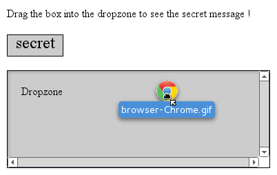

# Applications interactives

<!-- .slide: class="page-title" -->


## Plan

<!-- .slide: class="toc" -->

- [Introduction](#/1)
- [Nouvelles balises](#/2)
- [CSS 3](#/3)
- [JavaScript, le langage du web](#/4)
- **[Vers des application plus interactives](#/5)**
- [Gestion des données](#/6)
- [Multimédia](#/7)
- [Conclusion](#/8)

Notes :


## Plan

- Géolocalisation
- Drag'n'drop

Notes :


## Géolocalisation

- La géolocalisation permet de connaître la localisation de l'utilisateur
	- Marketing de proximité
	- Communautés
- Nécessite l'accord de l'utilisateur


Notes :


## Géolocalisation

- La localisation est déterminée grâce 
	- au GPS des appareils mobiles
	- à une triangulation GSM/3G
	- l'adresse IP du point de connexion
	- triangulation wifi
- Elle est accessible via l'objet navigator.geolocation
	- Pas toujours disponible !

```javascript
var geoloc = navigator.geolocation;
if (geoloc) {
…
}
```


Notes :


## Géolocalisation

- Deux méthodes pour récupérer la position
	- `getCurrentPosition() `  
Détermine la position courante de l'utilisateur
	- `watchPosition()`  
Suit le déplacement de l'utilisateur en temps réel

- Les deux méthodes acceptent les mêmes paramètres
	- une fonction callback en cas de succès
	- une fonction callback en cas d'échec
	- des options, sous forme d'une map
		- timeout (en ms)
		- maximumAge (en ms)
		- enableHighAccuracy (true|false)

Notes :


## Géolocalisation

- En cas de succès, les fonctions renvoient la même structure Position contenant les coordonnées (attribut coords) et un timestamp :
	- coords.latitude
	- coords.longitude
	- coords.accuracy
	- coords.altitude
	- coords.altitudeAccuracy
	- coords.heading (direction par rapport au nord)
	- coords.speed (en mètres / seconde)
	- timestamp

Notes :


## Géolocalisation

```javascript
function onSuccess(position) {
    var lat = position.coords.latitude;
    var lng = position.coords.longitude;
    window.alert(lat + "," + lng);
};

function onError(error) {
    switch(error.code) {
        case error.TIMEOUT: (…); break;
        case error.PERMISSION_DENIED: (…); break;
        case error.POSITION_UNAVAILABLE: (…); break;
        case error.UNKNOWN_ERROR: (…); break;
    }
};

navigator.geolocation
.getCurrentPosition(onSuccess, onError, {timeout:500});
```

Notes :


## Géolocalisation

- Affichage de la position sur une carte statique Google Maps
	- Carte statique, sans contrôles
	- Facile à intégrer

```
function onSuccess(pos) {
    var lat = pos.coords.latitude;
    var lng = pos.coords.longitude;
    var latlng = lat + "," + lng;

    var mapUrl = 
    "http://maps.googleapis.com/maps/api/staticmap"+
    "?center="+latlng+
    "&zoom=14&size=400x300&sensor=false"

    var mapHolder = document.getElementById("map");
    mapHolder.innerHTML = "";
};
```

Notes :


## Géolocalisation

- Pour une carte dynamique, il faut utiliser les API Google Maps
	- Affichage sur une carte dans une div d'id « mapCanvas » 

```html
    <script src="http://maps.google.com/maps/api/js?sensor=true"></script>
```

```javascript
navigator.geolocation.getCurrentPosition(function(pos) {
    var lat = pos.coords.latitude;
    var lng = pos.coords.longitude;
    var myPosition = new google.maps.LatLng(lat,lng);

    var opts = {
        zoom : 8,
        center : myPosition,
        mapTypeId : google.maps.MapTypeId.ROADMAP
    };

    var mapHolder = document.getElementById("mapCanvas")
    var map = new google.maps.Map(mapHolder, opts);
});
```

Notes :


## Géolocalisation

- Compatibilité


Notes :


## Drag'n'drop

- Le drag'n'drop ("glisser-déposer" selon la terminologie officielle) est un geste naturel

- Deux cas d'utilisation 
	- Déplacement d'éléments au sein du navigateur
	- Déplacement d'éléments externes vers le navigateur 


Notes :


## Drag'n'drop

- Tout élément peut être déplacé
	- Il suffit de lui ajouter l'attribut "draggable"
- Tout élément peut servir de zone de réception ("drop")

```html
    <div draggable="true"> … </div>
```


Notes :


## Drag'n'drop
  
Événements

- Événements relatifs à l'élément déplacé
	- dragstart : début de l'action
	- drag : action en cours
	- dragend : fin de l'action

- Événements relatifs à l'élément récepteur
	- dragenter : début de survol
	- dragover : survol en cours
	- dragleave : fin de survol
	- drop : élément lâché 

```javascript
    <element>.on<event> = function() { … }
```

Notes :


## Drag'n'drop
  
Événements – exemple

- Configuration de l'élément déplacé

```javascript
var item = document.getElementById("item");

// Activer le drag'n'drop
item.setAttribute('draggable', true);

// Changement d'opacité pendant le déplacement
item.ondragstart = function(e) {
    this.style.opacity = '0.4';
};

item.ondragend = function(e) {
    this.style.opacity = '1';
};
```

Notes :


## Drag'n'drop
  
Événements – exemple

- Configuration de la zone de réception
	- Par défaut, les éléments ne supportent pas le "drop" ; il faut désactiver ce comportement sur l'événement ondragover

```javascript
var dropzone = document.getElementById("dropzone");

zone.ondragover = function(e) {
    return false; // ou e.preventDefault(); OBLIGATOIRE !
};

zone.ondrop = function(e) {
    // ...
};
```

Notes :

Return false et e.preventDefault() permettent de ne pas laisser le navigateur ajouter un comportement par défaut.
Return false; permet de ne pas lancer l'événement aux parents de l'élément.


## Drag'n'drop

- Compatibilité


Notes :


## Drag'n'drop
  
Transfert de données intra-navigateur

- Il est possible d'associer des méta-données à l'élément déplacé
- Propriété dataTransfer de l'événement de drag'n'drop
	- setData(mime-type, value)
	- getData(mime-type)
	- clearData(mime-type)
	- types : mime-types des données transmises (tableau)

```javascript
item.ondragstart = function(e) {
    e.dataTransfer.setData('text/plain', this.innerText);
};

zone.ondrop = function(e) {
    e.preventDefault();
    this.innerHTML += e.dataTransfer.getData('text/plain');
};
```

Notes :


## Drag'n'drop
  
Transfert de fichiers vers le navigateur

- La propriété dataTransfer.files contient les descripteurs des fichiers posés dans la zone de réception
    - lastModifiedDate
    - name : nom court, sans le chemin
    - size : taille en octets
    - type : type mime

```javascript
zone.ondrop = function(e) {
    e.preventDefault();
    var files = e.dataTransfer.files;
    this.innerHTML = "";
    for (var f=0; f < files.length; f++) {
        var file = files[f];
        this.innerHTML += file.name + "<br/>";
    }
};
```

Notes :


## Drag'n'drop
  
Transfert de fichiers vers le navigateur

- Pour obtenir davantage d'informations sur les fichiers, il faut utiliser l'API FileReader
	- readAsDataURL(file) : renvoie l'URL complète du fichier
	- readAsBinaryString(file) : lit le fichier en binaire
	- readAsText(file, [charset]) : lit le fichier en UTF8

- La progression est monitorée par des méthodes callback
	- onabort(), onerror(), onload(), onprogress()
	- Paramètre de type ProgressEvent contenant le résultat

```javascript
reader.onload = function(e) {
    var url = e.target.result;
    var progress = e.loaded + "/" + e.total;
}
```

Notes :


## Drag'n'drop
  
Transfert de fichiers vers le navigateur

```javascript
zone.ondrop = function(e) {
    e.preventDefault();

    var files = e.dataTransfer.files;
    this.innerHTML = "";
    for (var f=0; f < files.length; f++) {
        var file = files[f];
        var reader = new FileReader();
        reader.onload = function (event) {
            var img = document.createElement("img");
            img.setAttribute('src', event.target.result);
            this.appendChild(img);
        };
        reader.readAsDataURL(file);
    }
    
    return false;
};
```

Notes :


## Drag'n'drop
  
Transfert de fichiers vers le navigateur




Notes :


## Drag'n'drop
  
Transfert de fichiers vers le navigateur

- Compatibilité


Notes :


## Drag'n'drop
  
Transfert de fichiers vers le navigateur

- Compatibilité


Notes :


<!-- .slide: class="page-questions" -->


<!-- .slide: class="page-tp3" -->