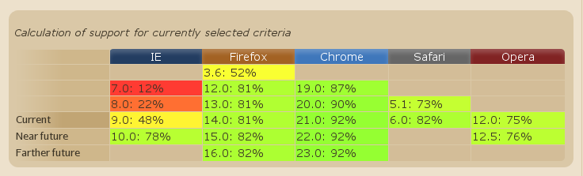

# Conclusion

<!-- .slide: class="page-title" -->

## Plan

<!-- .slide: class="toc" -->

- [Introduction](#/1)
- [Nouvelles balises](#/2)
- [CSS 3](#/3)
- [JavaScript, le langage du web](#/4)
- [Vers des application plus interactives](#/5)
- [Gestion des données](#/6)
- [Multimédia](#/7)
- **[Conclusion](#/8)**

Notes :

## Conclusion

- HTML 5 est une avancée majeure par rapport à HTML 4

- Des nouveautés dans tous les domaines
	- Web sémantique
	- Style graphique amélioré
	- Bases de données locales
	- Mode déconnecté
	- Interactivité
	- Multimédia sans plug-in
	- Et bien plus encore ! (cf. "HTML5 Avancé")

Notes :

## Conclusion
  
Un support très variable

- Un support encore très variable...
	- Selon html5test.com (sur 500 pts) :
		- Chrome 21..............437 pts
		- Chrome 20..............414 pts
		- Opera 12...............385 pts
		- Safari 6...............366 pts
		- Firefox 14.............345 pts
		- Safari 5.1.............317 pts
		- Internet Explorer 9....138 pts
		- Internet Explorer 8.....42 pts
		- Internet Explorer 7.....27 pts
		- Internet Explorer 6.....26 pts
- Mais ça progresse ! (doucement)
	- http://caniuse.com/

Notes :

## Conclusion
  
Support par navigateur

Notes :

## Conclusion

- Prévoir une stratégie de secours pour les anciens navigateurs
	- Javascript
	- Flash
	- Chrome Frame for IE

- Migrer sur les dernières versions disponibles
	- En particulier en interne

- La version définitive des spécifications HTML5 est prévue pour 2014

Notes :

## A suivre

- Frameworks HTML5
	- HTML5 boilerplate
	- Sencha Touch
	- Atmosphere

- Modernizr : permet de faciliter la détection des fonctionnalités et le fallback
- Les autres APIs
	- Historique et navigation
	- Communication API et Server Sent Events
	- WebSocket
	- Web workers
	- XmlHttpRequest 2
	- ...

Notes :

<!-- .slide: class="page-questions" -->

<!-- .slide: class="page-tp1" -->